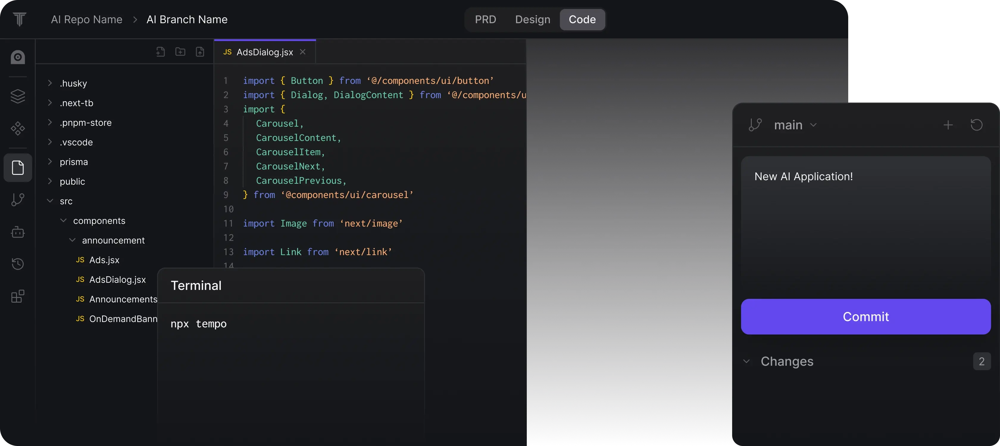

# LumiNIC-Q Premium Salon & Spa Platform

## Overview

LumiNIC-Q is a sophisticated salon and spa booking platform with AI-powered personalization that helps users discover and book premium services while receiving tailored recommendations. The platform features a modern, responsive design with intuitive booking flows and an AI assistant to enhance the user experience.



## Features

- **Modern Homepage**: Featuring service categories (haircare, skincare, massage, wellness), an AI chat assistant, and a prominent "Book Now" CTA
- **User Authentication**: Secure login/signup system with profile creation that captures preferences and service history
- **Intuitive Booking Flow**: Service selection, stylist/therapist choice, date/time picker, and confirmation steps
- **AI Chat Assistant**: Provides personalized service recommendations based on user inputs about mood, preferences, and needs
- **Premium UI/UX**: Clean, luxurious interface with Tailwind CSS, subtle Framer Motion animations, and a wellness-inspired color palette
- **Responsive Design**: Fully responsive across all device sizes
- **Secure Payments**: Integrated with Stripe for secure payment processing

## Tech Stack

- **Frontend**: React with TypeScript, Vite
- **Styling**: Tailwind CSS, Shadcn UI components
- **Animation**: Framer Motion
- **Database & Auth**: Supabase
- **Payments**: Stripe
- **AI Integration**: OpenAI API with fallback system
- **Form Handling**: React Hook Form with Zod validation

## Getting Started

### Prerequisites

- Node.js (v18 or higher)
- npm or yarn
- Supabase account
- Stripe account (for payment processing)
- OpenAI API key (optional, system works with fallback)

### Installation

1. Clone the repository
   ```bash
   git clone https://github.com/yourusername/luminic-q.git
   cd luminic-q
   ```

2. Install dependencies
   ```bash
   npm install
   # or
   yarn install
   ```

3. Set up environment variables
   Create a `.env` file in the root directory with the following variables:
   ```
   VITE_SUPABASE_URL=your_supabase_url
   VITE_SUPABASE_ANON_KEY=your_supabase_anon_key
   VITE_OPENAI_API_KEY=your_openai_api_key (optional)
   ```

4. Start the development server
   ```bash
   npm run dev
   # or
   yarn dev
   ```

5. Open your browser and navigate to `http://localhost:5173`

### Database Setup

The project uses Supabase for database and authentication. The necessary migrations are included in the `supabase/migrations` directory.

## Project Structure

```
├── src/
│   ├── components/         # UI components
│   │   ├── ai/             # AI assistant components
│   │   ├── auth/           # Authentication components
│   │   ├── booking/        # Booking flow components
│   │   ├── services/       # Service listing components
│   │   └── ui/             # Shadcn UI components
│   ├── lib/                # Utility functions and API clients
│   ├── pages/              # Page components
│   ├── stories/            # Component stories
│   └── types/              # TypeScript type definitions
├── supabase/               # Supabase configuration and migrations
└── public/                 # Static assets
```

## Key Components

- **AIAssistant**: AI-powered chat interface for personalized recommendations
- **BookingForm**: Multi-step booking process with service and time selection
- **ServicesList**: Display of available services with filtering options
- **AuthLayout**: Authentication screens with login and signup forms

## Deployment

The application can be deployed to any static hosting service that supports SPAs:

1. Build the production version
   ```bash
   npm run build
   # or
   yarn build
   ```

2. Deploy the contents of the `dist` directory to your hosting provider

## Contributing

1. Fork the repository
2. Create your feature branch (`git checkout -b feature/amazing-feature`)
3. Commit your changes (`git commit -m 'Add some amazing feature'`)
4. Push to the branch (`git push origin feature/amazing-feature`)
5. Open a Pull Request

## License

This project is licensed under the MIT License - see the LICENSE file for details.

## Acknowledgments

- [Shadcn UI](https://ui.shadcn.com/) for the beautiful component library
- [Tailwind CSS](https://tailwindcss.com/) for the utility-first CSS framework
- [Supabase](https://supabase.io/) for the backend services
- [Framer Motion](https://www.framer.com/motion/) for animations
- [OpenAI](https://openai.com/) for the AI capabilities

- Replace `plugin:@typescript-eslint/recommended` to `plugin:@typescript-eslint/recommended-type-checked` or `plugin:@typescript-eslint/strict-type-checked`
- Optionally add `plugin:@typescript-eslint/stylistic-type-checked`
- Install [eslint-plugin-react](https://github.com/jsx-eslint/eslint-plugin-react) and add `plugin:react/recommended` & `plugin:react/jsx-runtime` to the `extends` list
